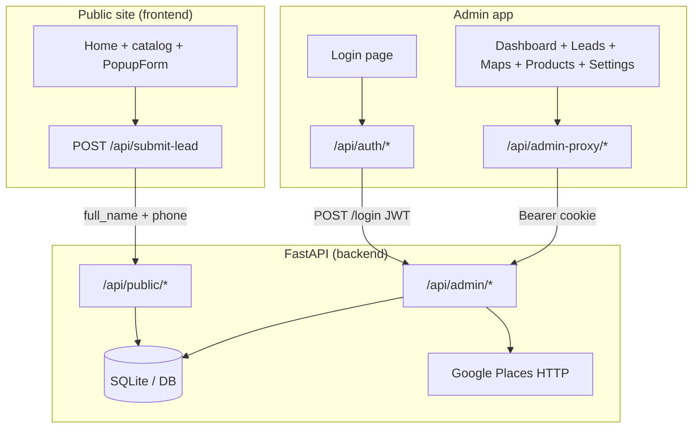

# Star Uniform Platform — System Architecture

This document describes the **Star Uniform** lead-generation and operations stack: the **FastAPI backend**, the **public marketing site** (Next.js), and the **admin console** (Next.js). It covers data models, API surfaces, how the pieces call each other, and the main **use cases** end to end.

---

## 1. Purpose and scope

The platform supports:

- **Inbound leads** from the public website (quote requests with name + phone).
- **Outbound / research data** from **Google Places**: businesses are collected by region and category, stored, filtered, and tracked through a contact workflow.
- **Admin operations**: authenticate staff, view dashboards, manage **leads**, manage **Maps** listings, see **products** (read-only catalog), configure **settings** (maps defaults, business info, export prefs, team), and **export** CSV/Excel.

---

## 2. Repository layout (logical)

| Area | Path | Role |
|------|------|------|
| Backend API | `backend/` | FastAPI + SQLAlchemy + SQLite (or `DATABASE_URL`) |
| Public site | `frontend/` | Next.js — catalog, region UI, quote popup |
| Admin app | `admin/` | Next.js — dashboard, leads, maps, products, settings |

---

## 3. High-level architecture

**Key idea:** The browser never sends the JWT to FastAPI directly for normal admin usage. The admin UI calls **same-origin** routes under `/api/admin-proxy/...`; the Next.js route handler reads the **httpOnly** `admin_token` cookie and forwards requests to `NEXT_PUBLIC_API_URL` with `Authorization: Bearer <token>`.

---

## 4. Data model (backend)

Persistence uses SQLAlchemy models in `backend/models.py` (tables created on app startup via `Base.metadata.create_all`).

### 4.1 `Lead`

Represents a **sales lead** (primarily from the website form).

| Concept | Notes |
|--------|--------|
| Identity | `id`, unique `phone` |
| Source | e.g. `website_form` (created by public submit) |
| Pipeline | `status` (`new`, `called`, `qualified`, …), `interested`, notes, call metadata (`called_date`, `called_by`) |
| Enrichment | Optional business fields (`business_name`, `address`, `rating`, `region`, …) for CRM-style use |
| Follow-up | `last_contacted`, `next_follow_up_at` |

**Relationship to Maps:** The UI can label sources such as “Maps Import”; the `Lead` model allows different `source` values. Today, the API path that **creates** leads from the public form sets `source="website_form"`. Maps rows are stored separately until staff work them as **Maps businesses**; “converted to lead” on a map row is a **flag on `MapsBusiness`**, not automatically a new `Lead` row unless you add that flow later.

### 4.2 `MapsBusiness`

Rows scraped or enriched from **Google Places** (Nearby Search + details).

| Concept | Notes |
|--------|--------|
| Place identity | `google_place_id` (unique when present) |
| Facts | `name`, `address`, `phone`, `website`, `rating`, `review_count`, `category`, `region` |
| Workflow | `contact_status`, `notes`, `is_converted_to_lead` |

### 4.3 `TeamMember`

Sales/ops people: `name`, unique `phone`. **Call counts** in the API are derived by counting `Lead.called_by` matching `TeamMember.name` (not by phone).

### 4.4 `AppSetting`

Key/value JSON (`value_json`) for:

- `maps_defaults` — default radius, enabled categories  
- `business_info` — business name, contact display fields  
- `export_prefs` — export-related preferences  
- `last_scrape` — metadata after a successful scrape run  

### 4.5 `AdminUser`

Stores admin email + bcrypt `hashed_password`. Login validates against this table. The **first** account is created via **`POST /api/admin/bootstrap/request`** (requires `ADMIN_BOOTSTRAP_SECRET` + Resend email) while no admins exist, then **`/setup`** in the admin app to set a password.

---

## 5. Backend (`backend/`)

### 5.1 Entry and routing

- **`backend/main.py`** mounts:
  - `routes/public` → prefix **`/api/public`**
  - `routes/admin` → prefix **`/api/admin`**
- **`GET /health`** — liveness for the API process.

### 5.2 Public API (`routes/public.py`)

| Endpoint | Purpose |
|----------|---------|
| `GET /api/public/health` | Public health |
| `POST /api/public/submit-lead` | Accepts `name`/`full_name` + `phone`; validates; creates `Lead` via `services.leads` |
| `GET /api/public/products` | Returns static product list from `services.products.list_products()` |

No authentication.

### 5.3 Admin API (`routes/admin.py`)

All endpoints below require **`Authorization: Bearer <JWT>`** except **`POST /api/admin/login`**, **`POST /api/admin/bootstrap/request`**, and **`POST /api/admin/bootstrap/complete`**.

**Authentication**

- `POST /login` — body: email + password; validated against **`AdminUser`** (bcrypt). Returns JWT (`auth.create_access_token`).
- `POST /bootstrap/request` — body: `bootstrap_secret` + email; only when **zero** admins. Sends a time-limited setup link via **Resend**.
- `POST /bootstrap/complete` — body: JWT from email + password; creates the first `AdminUser` and returns an access JWT.

**Settings and team**

- `GET/PATCH /settings` — aggregated maps/business/export/account/team snapshot; PATCH merges JSON blobs in `AppSetting`.
- `GET/POST/PATCH/DELETE /team-members` — CRUD for `TeamMember`; list includes `calls_made` from leads.

**Leads**

- `GET /leads` — paginated list with filters (status, region, source, date ranges, search, sort).
- `GET /leads/stats`, `GET /leads/stats/daily` — aggregates for dashboard charts.
- `PATCH /leads/{id}`, `PUT /leads/{id}` — update fields (PUT uses a narrower schema for some fields).
- `POST /leads/bulk-update`, `bulk-status`, `bulk-delete` — batch operations.
- `GET /leads/export/csv` — CSV download of all leads for export.

**Google Maps / Places**

- `POST /maps-collection/scrape` and `POST /maps/scrape` — same handler: run async collection (`services.google_maps_service`) for a **fixed region list** and **allowed categories** (`restaurants`, `lodging`, `bar`, `cafe`), radius in km; upserts `MapsBusiness`; records last scrape in `AppSetting`.
- `POST /maps/test-connection` — verifies Places API connectivity.
- `GET /maps-businesses`, `GET /maps/businesses`, `GET /maps/businesses/paginated` — paginated listings with filters (aliases for compatibility).
- `PUT /maps/businesses/{id}` — combined update (notes, contact status, converted flag).
- `PATCH` variants for `converted-to-lead`, `notes`, `contact-status`.
- Bulk: `bulk-contact`, `bulk-notes`, `bulk-delete`.
- `GET /maps/stats`, `GET /maps/regions`, `GET /maps/categories`.
- Exports: `POST /maps/export` (filtered CSV/Excel), `GET /maps/export/csv`, `GET /maps/export/excel`.

### 5.4 Services (layer)

| Module | Responsibility |
|--------|----------------|
| `services/leads.py` | Phone validation, create website lead, pagination, stats, bulk ops, CSV export list |
| `services/products.py` | Static product list for public API; **Maps** CRUD/query/stats/regions/export (`MapsBusiness`) |
| `services/google_maps_service.py` | Async Places Nearby Search + Place Details; region coordinates; save to DB; dedupe by phone key |
| `services/app_settings.py` | JSON settings + last scrape metadata + `maps_key_meta()` |
| `services/team_service.py` | Team CRUD + join with `Lead.called_by` for counts |
| `services/gemini_scoring.py` | **Optional** Gemini-based scoring helper — **not wired to any HTTP route** in the current codebase |

### 5.5 Auth (`auth.py`)

- JWT with `jose`, secret `JWT_SECRET_KEY`, expiry `ACCESS_TOKEN_EXPIRE_MINUTES`.
- `OAuth2PasswordBearer(tokenUrl="/api/admin/login")` for dependency injection on admin routes.

### 5.6 Schemas (`schemas.py`)

Pydantic models for request/response bodies and pagination wrappers shared by admin routes.

---

## 6. Public frontend (`frontend/`)

### 6.1 Pages and components

- **`app/page.tsx`** — Marketing home: region selector, static product catalog (aligned with backend SKUs conceptually), “Get Your Quote” opens the popup.
- **`app/components/PopupForm.tsx`** — Name + phone validation (Indian formats), timed auto-open, scroll guard, dismiss persistence. Submits to the **Next.js** route (not directly to FastAPI from the browser for the main path).

### 6.2 BFF route: `app/api/submit-lead/route.ts`

- **POST** accepts `{ name, phone }`.
- Server-side **fetch** to `{NEXT_PUBLIC_API_URL}/api/public/submit-lead` with `full_name` and `phone` to match backend expectations.
- Maps backend errors to user-facing messages.

**Use case:** *Visitor requests a quote* → form → Next API → FastAPI → `Lead` row → staff see it in admin **Leads**.

---

## 7. Admin frontend (`admin/`)

### 7.1 Auth flow

1. User submits credentials on **`/login`** → **`POST /api/auth/login`** (Next route).
2. Next route calls **`POST {API}/api/admin/login`**; on success sets **httpOnly** cookie `admin_token`.
3. **`GET /api/auth/session`** validates by calling **`GET {API}/api/admin/settings`** with the cookie-as-Bearer (implemented in the route) and returns `authenticated` + email from settings payload.
4. **`dashboard/layout.tsx`** — On load, calls `/api/auth/session`; if unauthenticated, redirects to `/login`.
5. **`POST /api/auth/logout`** — clears session cookie.

### 7.2 Authenticated API access

- **`lib/api.ts`** — `adminFetch(path)` → `fetch('/api/admin-proxy/' + path, { credentials: 'include' })`.
- **`app/api/admin-proxy/[...path]/route.ts`** — Proxies HTTP methods to `{NEXT_PUBLIC_API_URL}/api/admin/{path}` with `Authorization: Bearer` from cookie.

This avoids exposing the JWT to JavaScript while still allowing the admin UI to call the backend.

### 7.3 Dashboard areas

| Route | Purpose | Backend dependencies (examples) |
|-------|---------|----------------------------------|
| `/dashboard` | KPIs, charts (Recharts), recent leads/maps, call queue | `leads/stats`, `maps/stats`, `leads/stats/daily`, `settings`, `leads`, `maps-businesses` |
| `/dashboard/leads` | Table, filters, detail drawer, bulk actions, team picker, WhatsApp/tel links | `leads/*`, `team-members`, exports |
| `/dashboard/maps-data` | Scrape controls, region/category, table, charts, bulk actions, exports | `maps/*`, `maps-scrape` endpoints, `maps-businesses` |
| `/dashboard/products` | Read-only table | **`GET {API}/api/public/products`** via `getApiBase()` — **no admin proxy** (public catalog) |
| `/dashboard/settings` | Maps/business/export/account UI | Mix of **`GET/PATCH`** `settings` and local/MVP UI state (some prefs are still local-only in the UI layer) |

---

## 8. Use cases and how they connect

### UC1 — Public quote request

1. User fills **PopupForm** on the public site.
2. Next **`/api/submit-lead`** forwards to **`POST /api/public/submit-lead`**.
3. Backend creates a **`Lead`** (`source=website_form`, `status=new`).
4. Admin opens **Leads**; lists and updates the lead (status, notes, called_by → ties to **team** call counts).

### UC2 — Discover businesses via Maps

1. Admin configures region + category + radius on **Maps Data**.
2. **POST** scrape triggers **Places API** (Nearby + Details), upserts **`MapsBusiness`**, updates **`last_scrape`** settings.
3. **Maps Data** and **Dashboard** show counts and recent rows.

### UC3 — Outreach and pipeline on Maps rows

1. Staff filters listings, updates **contact_status**, **notes**, or **is_converted_to_lead**.
2. Bulk actions update many rows at once.
3. Exports pull CSV/Excel for offline work or CRM.

**Note:** “Converted to lead” on a map row is stored on **`MapsBusiness`**. Turning that into a **`Lead`** record in the same database would be a separate product decision (not implemented in the routes reviewed above).

### UC4 — Team performance visibility

1. **`TeamMember`** records define who can be selected as `called_by` (by name alignment).
2. **`calls_made`** on team API responses counts **`Lead`** rows where `called_by` matches that member’s **name**.

### UC5 — Admin configuration

1. **`GET/PATCH /settings`** reads/writes **`AppSetting`** JSON for maps defaults, business card info, and export preferences.
2. Dashboard may show **revenue_display**-style fields from `business` in settings.

### UC6 — Product catalog visibility

1. Public **`GET /api/public/products`** serves a static list from the backend.
2. Public site uses a **local** product array for UI; admin **Products** page fetches the same backend list for an operational view.

---

## 9. External integrations

| Integration | Usage |
|-------------|--------|
| **Google Places API** | Nearby Search + Place Details; requires `GOOGLE_MAPS_API_KEY`. Regions are a fixed set in `google_maps_service.REGIONS`. |
| **JWT** | Admin session after DB-backed login; short-lived signed token for first-admin email setup. |
| **Resend** | Sends the first-admin setup link; `RESEND_API_KEY`, `RESEND_FROM_EMAIL`. |
| **Gemini** (optional) | `GEMINI_API_KEY` + `gemini_scoring.score_lead` — present but **not exposed via HTTP** in the current app. |

---

## 10. Configuration (environment)

Typical variables (see `backend/.env.example` for backend):

- **Backend:** `DATABASE_URL`, `JWT_SECRET_KEY`, `ACCESS_TOKEN_EXPIRE_MINUTES`, `ADMIN_BOOTSTRAP_SECRET`, `ADMIN_APP_BASE_URL`, `RESEND_API_KEY`, `RESEND_FROM_EMAIL`, `GOOGLE_MAPS_API_KEY`, `TEAM_MEMBERS` (seed names when team table is empty), optional `GEMINI_API_KEY`.
- **Next.js (admin + frontend):** `NEXT_PUBLIC_API_URL` — base URL for the FastAPI server (e.g. `http://localhost:8000`).

---

## 11. Design decisions (summary)

- **Split public vs admin API** prefixes reduce accidental exposure; admin routes uniformly depend on JWT.
- **Admin token in httpOnly cookie + server proxy** avoids XSS stealing the bearer token from `localStorage`.
- **SQLite by default** keeps local dev simple; `DATABASE_URL` allows hosted Postgres (for example Neon).
- **Maps** are first-class **stored entities** with their own workflow; **Leads** are first-class **inbound** entities — both support the sales process without forcing one model to do everything.

---

*This file reflects the codebase structure and behavior as implemented in the Star Uniform platform repository.*
